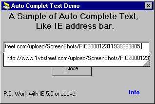



## AutoCompleteText

### Description

This is a very simple demonstration of the beginner VB programmer to show how they can improve there projects and give a professional touch to implement the ideas of auto-text. As IE address bar.

This Sample also shows how to work with windows API's.

I hope Beginners could enjoy this demo project and could get some really nice idea for improvements.

Thx.
 
### More Info
 
Text

Need to Have IE 5.0 or +

             |
---                |---
**Submitted On**   |2002-09-11 17:34:36
**By**             |[Deepak Kumar Shaw](https://github.com/Planet-Source-Code/PSCIndex/blob/master/ByAuthor/deepak-kumar-shaw.md)
**Level**          |Beginner
**User Rating**    |4.7 (14 globes from 3 users)
**Compatibility**  |VB 4\.0 \(32\-bit\), VB 5\.0, VB 6\.0
**Category**       |[VB function enhancement](https://github.com/Planet-Source-Code/PSCIndex/blob/master/ByCategory/vb-function-enhancement__1-25.md)
**World**          |[Visual Basic](https://github.com/Planet-Source-Code/PSCIndex/blob/master/ByWorld/visual-basic.md)
**Archive File**   |[AutoComple1404371042002\.zip](https://github.com/Planet-Source-Code/deepak-kumar-shaw-autocompletetext__1-39521/archive/master.zip)

